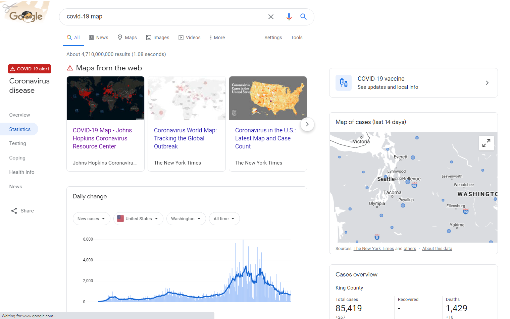
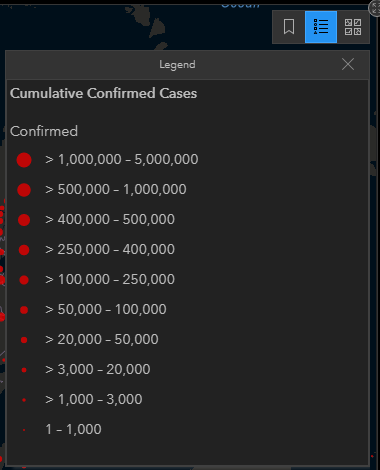
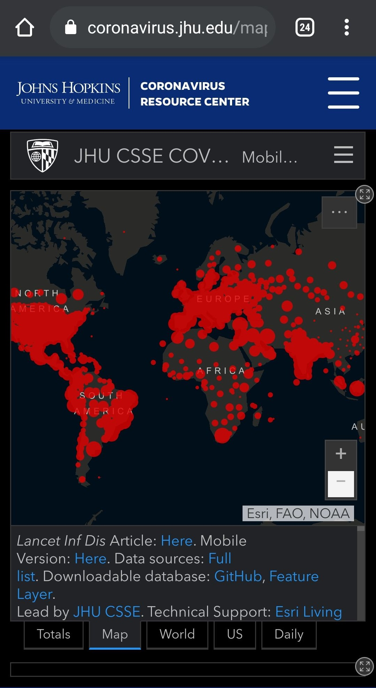
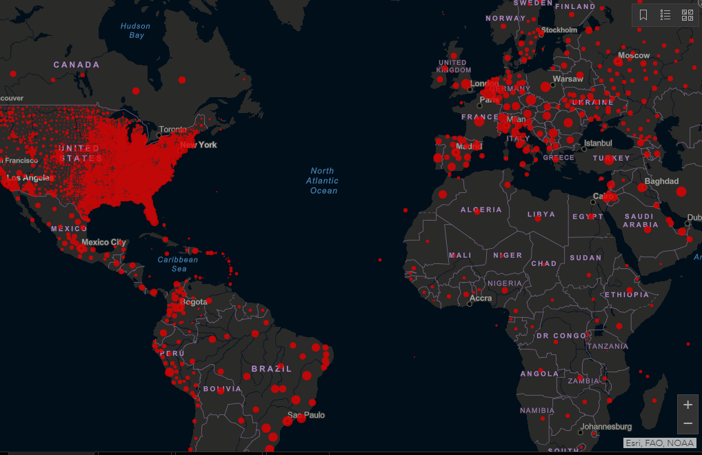
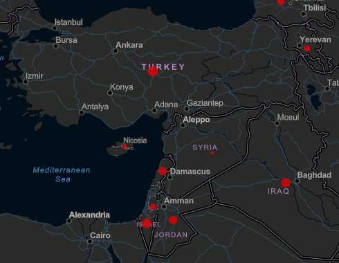

# Analysis on COVID-19 Dashboard by the Center for Systems Science and Engineering (CSSE) at Johns Hopkins University (JHU)
# By Lizhi Peng
## Introduction
The worldwide pandemic covid-19 has plagued the world for well over a year at this point. Unsurprisingly, in this internet age, countless web maps and stats trackers are built and made available to the public in light of the pandemic. In this essay I will be performing an analysis on the dashboard [Covid-19 Map](https://coronavirus.jhu.edu/us-map) by Johns Hopkins University. Note that there are actually two dashboards under the Coronavirus Resource Center(CSC), one being the global dashboard and one being the United States Dashboard. **For the purpose of this essay I will only be analyzing the global dashboard**. I chose the John Hopkins dashboard because it is currently one of the top search results under “covid-19 map” on google, meaning the average internet user will most likely stumble upon it when searching for covid-19 related infographics. While this alone doesn't make it any superior to other sources, it certainly shows it's one of the most influential dashboards on the internet today.

*google search result shows it as the top result for "covid-19 map"*

The dashboard's main purpose, true to its name, is to keep its users informed of the current covid-19 pandemic outbreak across the globe. The target audience can be anyone since it's open and free to the public, from professionals working on covid-19 related projects to individuals trying to educate themselves on the current pandemic, but users from the United States will find it more helpful since the data collected are heavily US-centric compared to other countries, an example being the testing rate option only has data for the US available. The map keeps track of a number of useful covid-19 related data such as cumulative cases, incidence rates, case-fatality ratios and recovered cases by country on the global map and offers many other statistics on the side.

## Basic Information
The dashboard is published by the [Coronavirus Resource center](https://coronavirus.jhu.edu/about) at John Hopkins University of Medicine. The effort started in January 2020 as one of the first global maps to track covid-19, before WHO has even declared it a global health emergency. The web map has since evolved into the Coronavirus Resource Center today and still collects and analyzes covid-19 related data on the daily. The team behind the dashboard consists of experts from Johns Hopkins University's various departments, with the majority being from the Bloomberg School of Public Health.

As their website states, it currently receives financial support from [John Hopkins University](https://www.jhu.edu/), the [National Science Foundation](https://www.nsf.gov/awardsearch/showAward?AWD_ID=2028604), [Bloomberg Philanthropies](https://www.bloomberg.org/) and the [Stavros Niarchos Foundation](https://www.snf.org/), it also accepts public donations. It receives technical support from [ESRI ArcGIS Living Atlas of the World](https://livingatlas.arcgis.com/en/home/) and [John Hopkins Applied Physics Laboratory](https://www.jhuapl.edu/) and relies on resource support from [Slack](https://slack.com/), [GitHub](https://github.com/) and [Amazon Web Services](https://aws.amazon.com/).

## Map Elements
The global map is represented by a proportional symbol map, although it could be easily mistaken for a dot density map due to the sheer amount of data points there are in the US region. The map is very minimalist and didn't include some of the traditional map elements that are unrelated to the data, such as scales or compass. But it does come with the basics like titles and credits. On a glace it may seem like there's no legend either, but it's actually hidden in the top right drop down menu. .

## Systematic Architecture
The data for the project is stored on [GitHub](https://github.com/CSSEGISandData/COVID-19) and is open to public. The data comes from over 260 different sources, from reputable media, most of which are US based, to government institutions (mostly for foreign sources) across the globe, there are too many to list here but they can be found in the GitHub page above. The dataset is maintained and updated on the daily basis between 04:45 and 05:15 GMT.
The dashboard itself is made using ArcGIS and is being hosted on [ArcGIS servers](https://www.arcgis.com/apps/opsdashboard/index.html#/bda7594740fd40299423467b48e9ecf6), the Coronavirus Resource Center page uses an embedded version of it. Beyond that I couldn't make much out of how it interacts with the server since it's not open source.

## UI/UX Design
The UI for this dashboard is very pleasant for viewing. It gives off a minimalist and professional feel, similar to some of the stock trading platforms. It uses the ESRI basemap streets(night), which is easy on the eye and free of unnecessary features. Despite there being many widgets on the dashboard, it feels compact but not cluttered. The dashboard also used different colors for different data numbers: red for cases, white for deaths and blue for test results, which gives them a thematic feeling and helps the user distinguish the dozens of numbers on their screen. The dots on the map are interactable, clicking on them opens a small popup that displays relevant information depending on the current map type.

It's worth noting that it's very easy to miss the menu since the color blends in with the map itself, but it offers two other features, one being bookmarks that will set the map to a predetermined center and zoom level, the other being to select a different basemap. below the map are the settings to display different data, by default this is set to cumulative cases, but can be switched to incidence rate and case-fatality ratio. There is also the testing rate option but only data for the US is available.

Outside of the map, the dashboard has several widgets, all of which are interactable: left of the map shows a current ranking list of countries by cases, there are options for 3 different administrative levels but the last one is only for the US. Right side of the map there are two more statistics, one for global deaths/recovered and one for US test results/deaths. At the bottom right corner there is a graph of daily cases, this can be toggled between several different statistics such as cumulative cases and log cases.

On pc, the websites responds well to screen of various sizes I've tested on. While the site technically supports mobile version, but suffers in quality both visually and performance wise. See screenshot below.

## Pros and Cons
To begin with the pros, the dashboard is well designed overall pleasant to view. It does what a dashboard is supposed to do: to display relevant information without overwhelming the user.
Other than that there is not much that especially stands out to me.

My biggest complaint with the dashboard is its optimization issue. On both my laptop and my mobile device, the web map suffers from noticeable lag. I monitored the CPU and memory usage for the site through windows task manager and confirmed it uses twice as much memory as compared to the google covid-19 dashboard, which also displays a web map and similar statistics. I believe this is the result of attempting to render too many data points at once on screen. Another criticism I have is the inconsistency of the global map, while some countries(such as Germany, Spain) receives a data point for each of their cities, other countries(like most countries in Africa and the Middle East) has their entire country represented by a single data point. This is especially noticeable when it comes to US, since every county receives its own data point on the map, and resulting in cluttering up the map and severely affecting the performance.
I believe it is entirely unnecessary to go into such details on the global map when there's already a US map available to the user, these county level data should be combined into to state level data at the very least.

*Countries in Africa are represented by a single data point while US clutters up the map up with thousands of county-level data points*

Another Criticism I have is that the dot sizes are too similar between similar levels and the bin sizes chosen are a bit inappropriate. On [Google's covid-19 map](https://news.google.com/covid19/map), for example, it's very easy to tell the number of cases in a country compared to its neighbors, but here you can have one data point with 3 times the number of cases of its neighbors but look so similar in size that you can't tell the difference from afar. 
*Turkey has over 2.8 million cases while Israel has 0.8 million, they're in different bins but the size difference is barely noticable*

## Reflections
To connect this analysis with our course materials, I believe this dashboard is in how geography can shape people's views. This map is undeniably US-centered, from displaying most data from the US to having several tabs dedicated to displaying US data on the dashboard, everything drives home the idea that the US is far more important than any other countries on the map. Someone from Morocco, for example, would learn very little about their own country from using this map, when their entire country is represented by a single red dot, meanwhile users in the US can make get a lot more meaningful data out of it. However, many countries, especially developing and smaller countries, either don't have the resources or demands to warrant a project of similar size as this, often times resulting in their users having to rely one US-centric infographics like this. Users from these countries just have to accept the fact that their countries just aren't as important as the US on the global stage. And this in turn further enhances the idea of the US being the current world leader.
